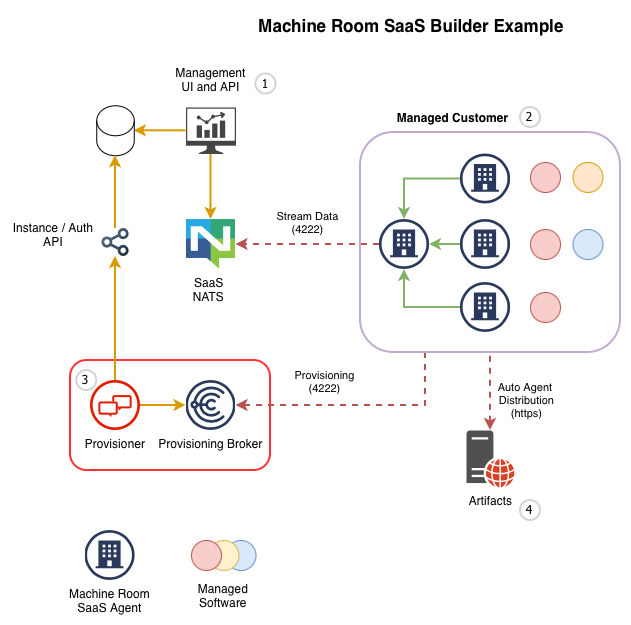

## Example Machine Room-based SaaS

This is an evolving example setup of a machine room-based SaaS. It is based on a previous example that has been lost.

This re-creates that example and will slowly evolve it to be a bit more realistic.

## Overview

This diagram shows the overall architecture of the example. 

1. The goal is to create a SaaS that can manage software deployments in many customer sites (2) here we have Dashboards, API etc
2. The customer sites are connected to a central server (1). One server is designated `leader` and runs a Choria Broker that hosts some streams and replicate data to/from the backend.
3. The customer sites are provisioned using a Choria Provisioner that interacts with the backend via API calls to get credentials and configuration
4. Software managed in the customer site is via Autonomous Agents which are downloaded by the customer site from a artifact server via HTTPS




At present the Dashboard, Database and API is not in this demo - that is inherently specific to the SaaS being built. Data ends in the `SaaS NATS` ready for consumption.

Machine Room presents the `SaaS NATS` as the only interaction point with the customer sites, the management portal consumes streams for node state and events and write Key-Value data to capture configuration values and desired plugins to deploy to a site.

At present no RPC is supported to the Customer Sites.

## Using

Run `docker compose up --build` which will build the agent container (example/agent) and start the entire setup.

When done do `docker compose down -v` to shut everything down.

At start the `example/setup.sh` is run to create all the credentials and then while running the `shell` instance can be accessed and it has all the generated files, configurations etc in `/machine-room`

## SaaS Data

Log into the `saas-nats` using `docker compose exec -ti saas-nats sh`.

Check the streams are created:

```
/ # nats --user backend --password s3cret s ls
╭────────────────────────────────────────────────────────────────────────────────────────────────╮
│                                             Streams                                            │
├─────────────────────────┬─────────────┬─────────────────────┬──────────┬────────┬──────────────┤
│ Name                    │ Description │ Created             │ Messages │ Size   │ Last Message │
├─────────────────────────┼─────────────┼─────────────────────┼──────────┼────────┼──────────────┤
│ MACHINE_ROOM_SUBMISSION │             │ 2026-03-25 11:08:34 │ 0        │ 0 B    │ never        │
│ MACHINE_ROOM_EVENTS     │             │ 2026-03-25 11:08:34 │ 17       │ 13 KiB │ 3.87s        │
│ MACHINE_ROOM_NODES      │             │ 2026-03-25 11:08:34 │ 4        │ 19 KiB │ 1m59s        │
╰─────────────────────────┴─────────────┴─────────────────────┴──────────┴────────┴──────────────╯
```

Here we have 

- `MACHNE_ROOM_NODES` that holds compressed facts for each customer node.
- `MACHINE_ROOM_EVENTS` that holds various events Choria produce and events from Autonomous Agents.
- `MACHINE_ROOM_SUBMISSION` that holds the data submitted by the customer sites to the SaaS - currently this is mostly unused.

View new events arriving using `nats --user backend --password s3cret sub --stream MACHINE_ROOM_EVENTS '>' --last` 

The customer instances downloaded the `echo` plugin, look for logs like: 

```
customer-nats3-1     | time="2026-03-25T11:11:57Z" level=warning msg="machines_manager#manage_machines: Deploying plugin echo from http://plugins.backend.saas.local/echo-0.0.1.tgz into /etc/saas-manager/machines" component=machine
customer-nats3-1     | time="2026-03-25T11:12:17Z" level=warning msg="Loaded Autonomous Agent echo version 0.0.1 from /etc/saas-manager/machines/echo (e56840080bead7145ce462f0b383238d)" component=aagent
```

The node data is unfortunately quite nested, a bug we'll address in the future, but for now this is required:

```
/ # apk add jq
/ # apk add gzip
/ # nats --user backend --password s3cret s get --last-for machine_room.nodes.cust_one.app1.managed.example.net MACHINE_ROOM_NODES --json|jq '.data |@base64d|fromjson|.data|fromjson|.zcontent' |base64 -d |gunzip
{"agents":[{"license":"Apache-2.0","author":"R.I.Pienaar \u003crip@devco.net\u003e","timeout":20,"name":"choria_provision","version":"0.29.4","url":"https://choria.io","description":"Choria Provisioner"},{"license":"Ap....
```

This is based on the configuration in Key-Value store `CONFIG` in the customer account:

```
/ # nats --user cust_one_admin --password s3cret kv get CONFIG machines --raw
{"plugins":"WwogIHsKICAgICJuYW1lIjogImVjaG8iLAogICAgInNvdXJjZSI6IC.....
```

The data flows into a MongoDB instance, using RedPanda Connect running in the `redpanda-connect-nodes` container, you can verify this is working and node data shows up in MongoDB:

```
$ docker compose exec -ti mongo bash
root@mongo:/# mongosh -u mr -p s3cret
test> use machineroom
machineroom> db.nodes.find({}, {"timestamp": 1, "hostname":1}).sort({"hostname": 1})
[
  {
    _id: ObjectId('69c40345d384ee449f8defc5'),
    message: {
      facts: {
        host: { info: { hostname: 'app1.managed.example.net' } },
        machine_room: { timestamp: '2026-03-25T15:46:08.84398726Z' }
      }
    }
  },
....
]
```

New data should arrive every 5 minutes.

## Dashboard

A completely Claude Code written dashboard is available on port 8080. This just shows a read-only view of the node data.

## Creating and deploying plugins

TODO